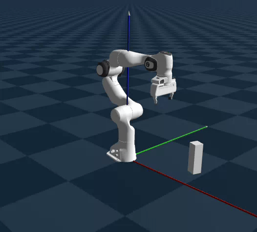

# Motion Planning with Goal Regions

This repository documents the system design and structure of a larger research project titled  
**“Motion Planning in Semi-Static Environments with Goal Regions.”**  
The focus here is on representing continuous workspace goals using goal regions and leveraging this representation for experience-based motion planning.

## Semi-Static Environments

A semi-static environment consists of static obstacles and *semi-static* objects, where semi-static objects may change pose between queries but remain fixed during the execution of any single query.

<!--


<figure>
  
  <figcaption><strong>Fig 1:</strong> A semi-static environment.  </figcaption>
</figure>

-->

<p align="center">
  
  <br>
  <strong>Fig. 1:</strong> A semi-static environment
</p>
  
When object poses vary over a continuous distribution, each grasping query induces a distinct motion planning problem, resulting in an effectively unbounded family of planning instances.  
To address this, we adopt an experience-based planning strategy that precomputes and stores representative solution paths covering the feasible goal space. At query time, previously computed paths are retrieved and reused, enabling queries within a fixed-time bound.

## Goal Regions

Building on Task Space Regions (TSRs) from [Berenson 2011](https://www.ri.cmu.edu/publications/task-space-regions-a-framework-for-pose-constrained-manipulation-planning/), we represent continuous workspace goals with a set of TSR intersections.  
By representing subsets of the continuous object pose distribution using a finite collection of TSR intersections, we can sample representative workspace goals from each region and store corresponding solution paths to provide coverage over the object’s pose distribution.

## Queries

Using the above strategy, we create and load a data structure of precomputed solution paths. A query is defined as the retrieval of a solution path from this data structure. This design enables constant-time queries at the cost of a large memory footprint.

<p align="center">
  
  <br>
  <strong>Fig. 2:</strong> Querying solutions from the data structure
</p>

This design reflects an explicit time–memory tradeoff: the system prioritizes predictable, constant-time queries by precomputing and storing a large number of solution paths. Ongoing work explores alternative representations that reduce memory usage while preserving bounded query-time performance.

## Algorithm

This section summarizes the current pipeline in algorithmic form. The system consists of an offline preprocessing stage that constructs the experience data structure, and an online query stage that retrieves a precomputed solution path. In the current implementation, a *query* is defined as constant-time retrieval of a precomputed solution path from the loaded data structure.

### Offline Precomputation (Experience Library Construction)

The current implementation assumes that the only semi-static object is the one being queried for a grasp. Further developments will include semi-static obstacles.

**Inputs:**  
- Static obstacle configurations
- Semi-static object pose distribution N
- Home configuration q_home 
- Grasp TSR constructor TSR(pose)

**Output:**  
- Experience data structure D mapping object pose regions to solution paths

```text
Algorithm 1: GOAL_REGION_LIBRARY_CONSTRUCTION
1: Initialize empty data structure D
2: Select initial object pose P1 ∈ N
3: Compute initial TSR, B1 = TSR(P1)
4: Initialize covered pose set C ← {P1}

5: while C does not sufficiently cover N do
6:   Select a new object pose P2 ∈ N \ C
7:   Compute new TSR B2 = TSR(P2)
8:   if B1 ∩ B2 ≠ ∅ then
9:     Sample workspace goal W ∈ (B1 ∩ B2)
10:    Compute inverse kinematics solution q_goal for W
11:    Plan path p_path = PLAN(q_home, q_goal)
12:    Store p_path in D associated with CONVEX_HULL(P1, P2)
13:    Update covered pose set C ← C ∪ CONVEX_HULL(P1, P2)
14:    Update reference pose P1 ← P2
15:    Update reference TSR B1 ← B2
16:  end if
17:end while       

18:return D
```
Owing to the convexity of Task Space Regions and the specific selection of object poses during preprocessing, a solution path computed for object poses P1 and P2 remains valid for all intermediate object poses lying between them. As a result, a single stored path provides coverage over a region of the object pose space rather than only the sampled endpoints.

### Online Query (Hashtable Lookup)

**Inputs:**  
- Observed semi-static object pose P
- Experience data structure D

**Output:**  
- Precomputed solution path, or failure

```text
Algorithm 2: Query
1. Determine object-pose bin R such that P ∈ R
2. if D contains a path associated with R then
3.   return D[R]
4. else
5.   return failure
```

## Performance
