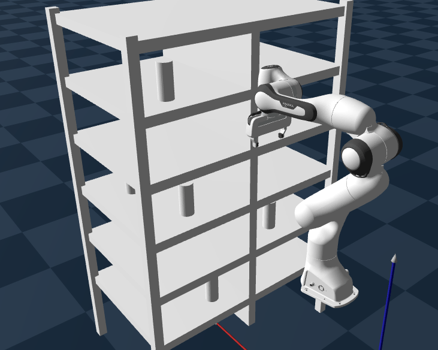

# Motion Planning with Goal Regions

This repository documents the system design and structure of a larger research project titled  
**“Motion Planning in Semi-Static Environments with Goal Regions.”**  
The focus here is on representing continuous workspace goals using goal regions and leveraging this representation for experience-based motion planning.

## Semi-Static Environments

A semi-static environment consists of static obstacles and *semi-static* objects, where semi-static objects may change pose between queries but remain fixed during the execution of any single query.

<!--

-->

<figure>
  
  <figcaption><strong>Fig 1:</strong> A semi-static environment.  </figcaption>
</figure>
  
When object poses vary over a continuous distribution, each grasping query induces a distinct motion planning problem, resulting in an effectively unbounded family of planning instances.  
To address this, we adopt an experience-based planning strategy that precomputes and stores representative solution paths covering the feasible goal space. At query time, previously computed paths are retrieved and reused, enabling queries within a fixed-time bound.

